# Лабораторная работа №2. Обесцвечивание и бинаризация растровых изображений. Адаптивная бинаризация Вульфа. Окно 7 × 7
Исходное изображение

Полутоновое изображение

---
##### 2 Приведение полутонового изображения к монохромному методом пороговой обработки
#### Контурная карта
Оригинальное изображение
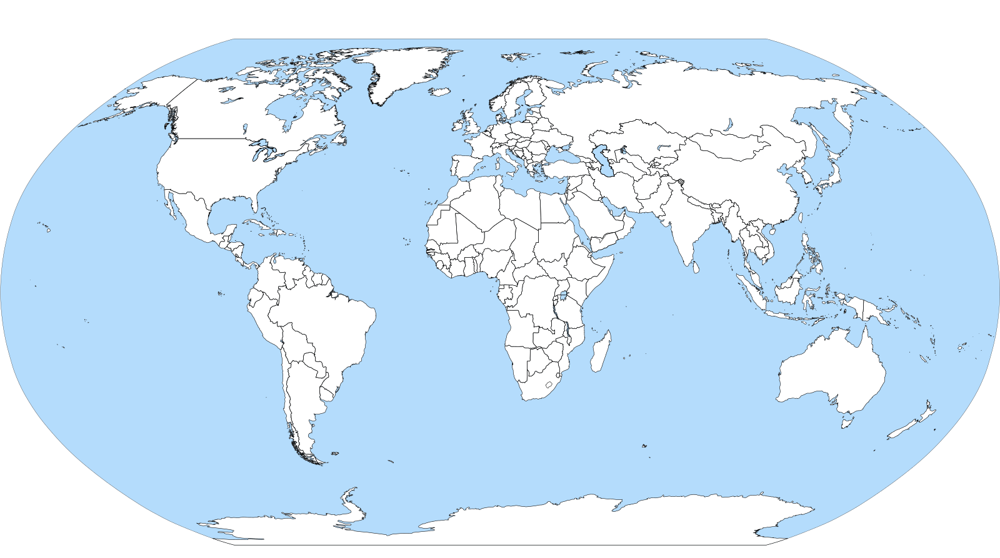

Полутоновое изображение
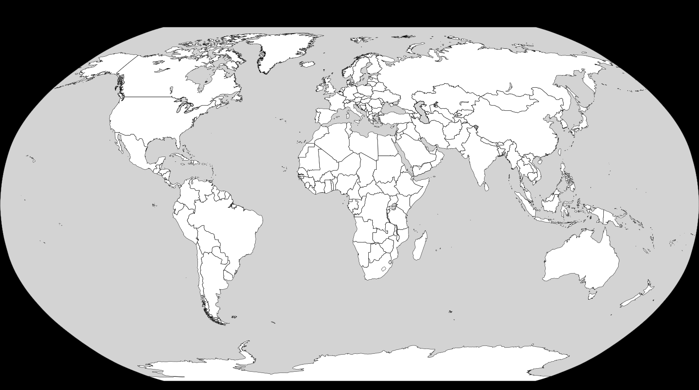

Монохромное изображение
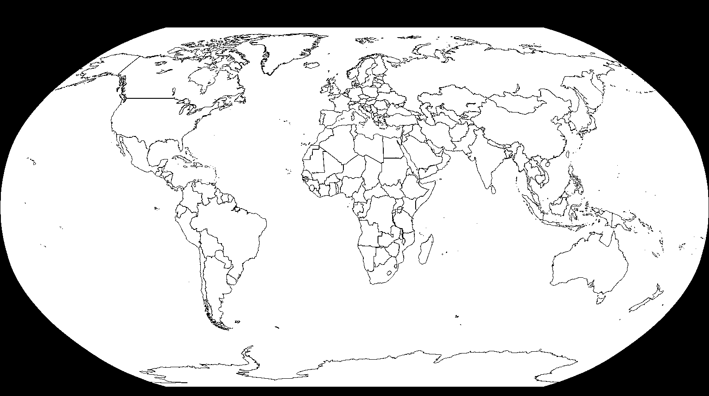

---
#### Рентгеновский снимок
Оригинальное изображение
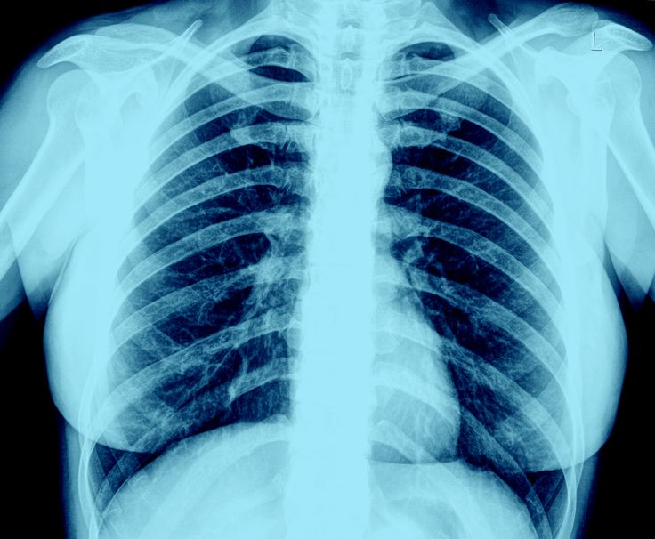

Полутоновое изображение
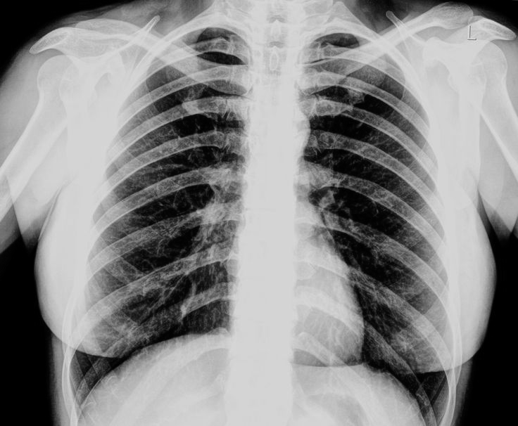

Монохромное изображение
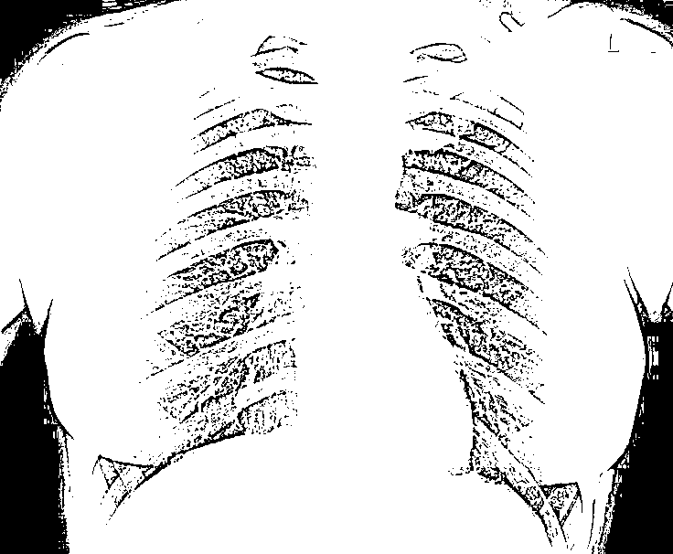

---
##### Еда
Оригинальное изображение
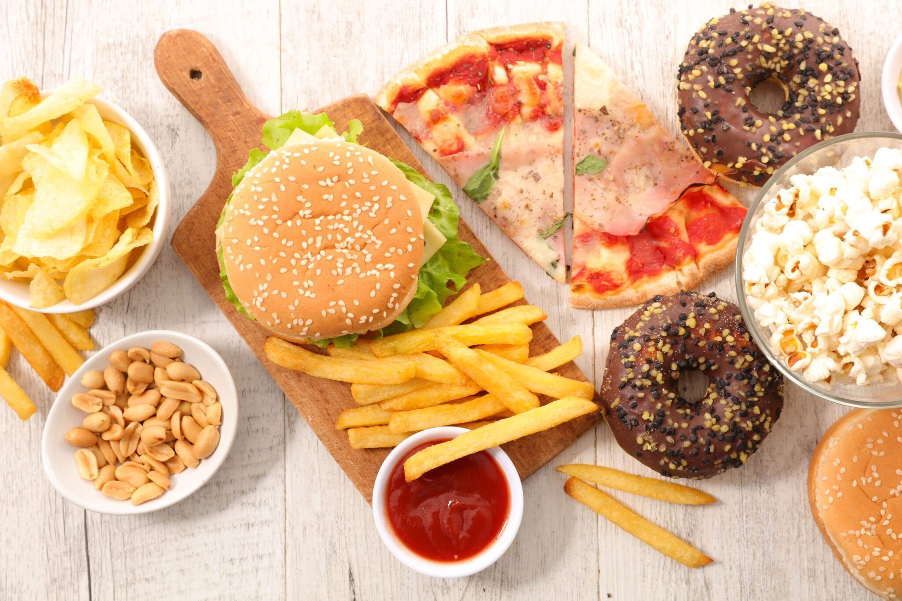

Полутоновое изображение
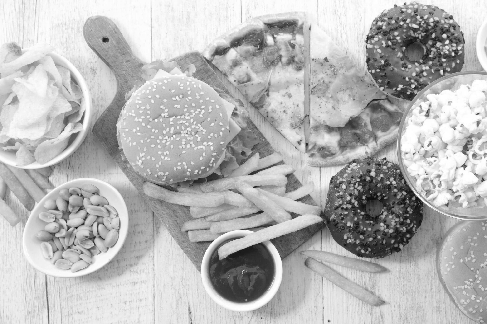

Монохромное изображение
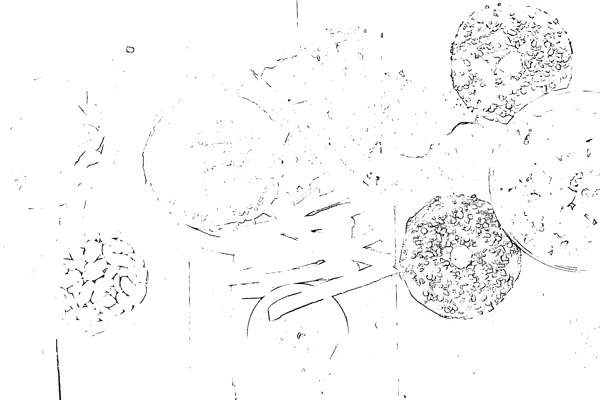

---
##### Фотография
Оригинальное изображение

Полутоновое изображение

Монохромное изображение
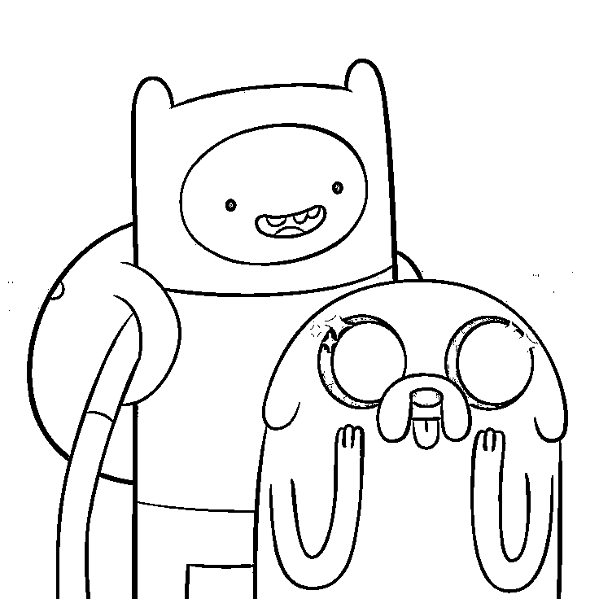

---
##### Здание
Оригинальное изображение
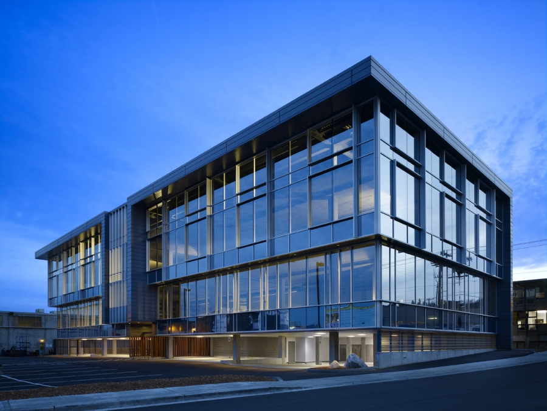

Полутоновое изображение
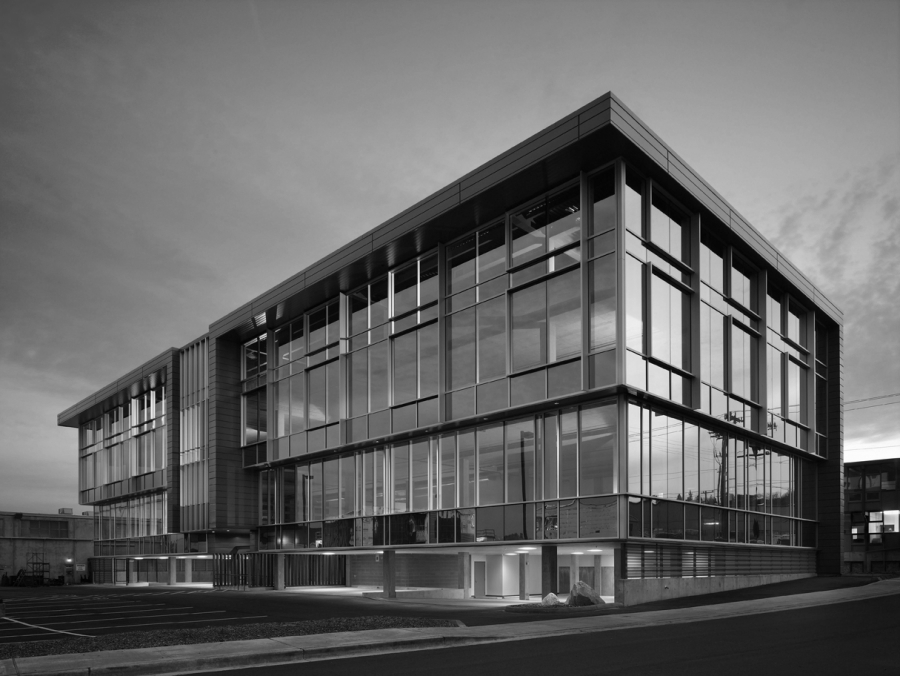

Монохромное изображение
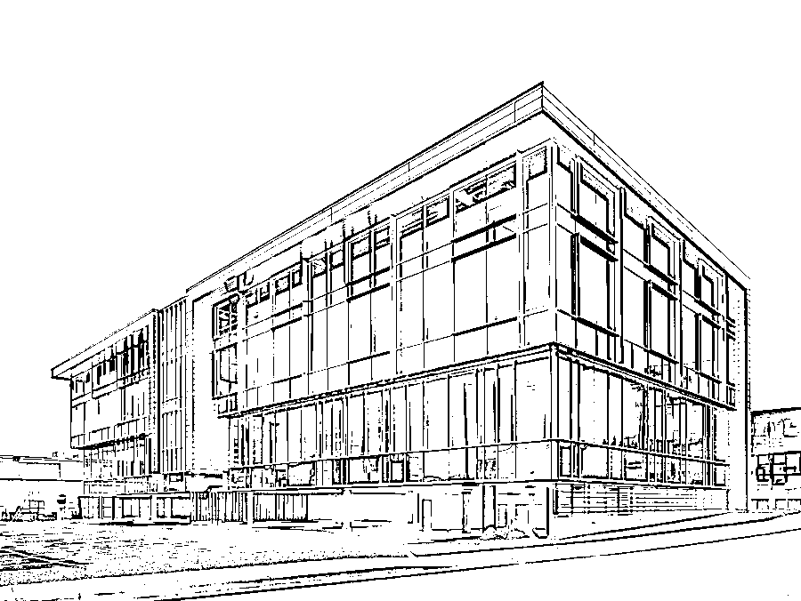

---
##### Cтраница текста
Оригинальное изображение
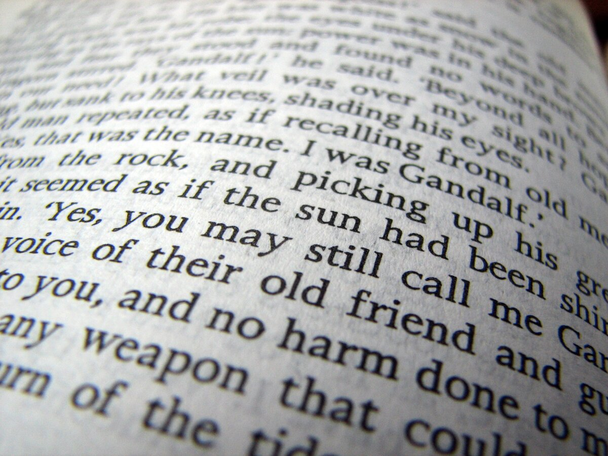

Полутоновое изображение
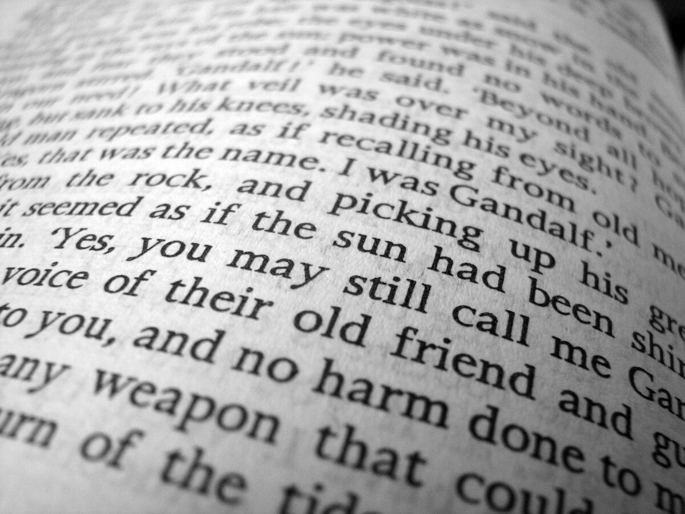

Монохромное изображение
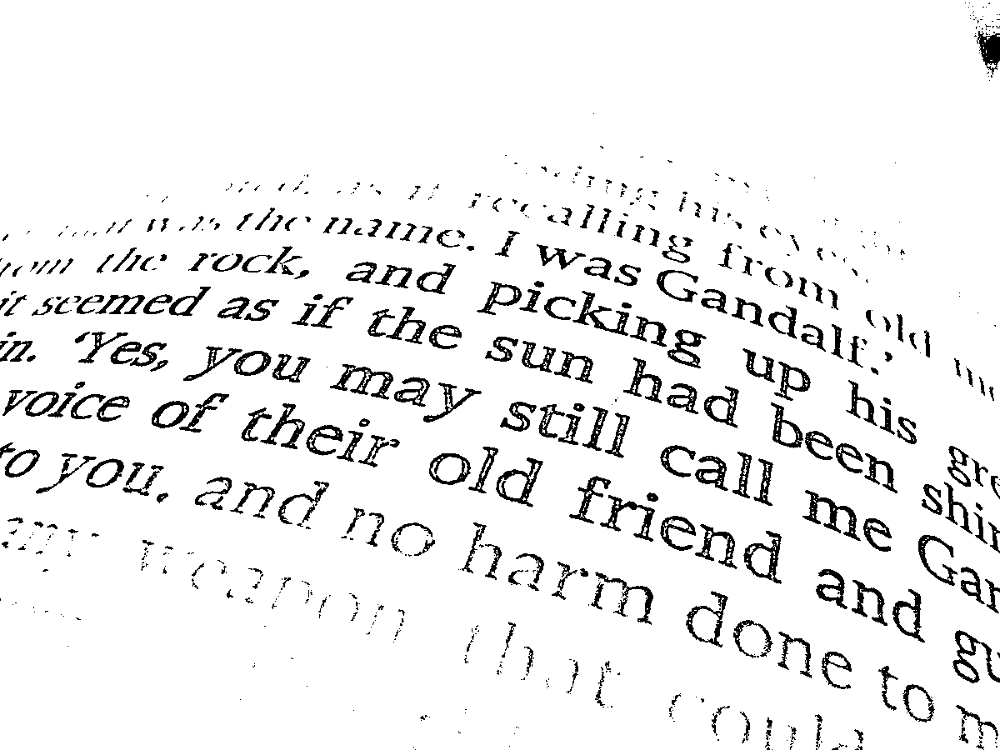
