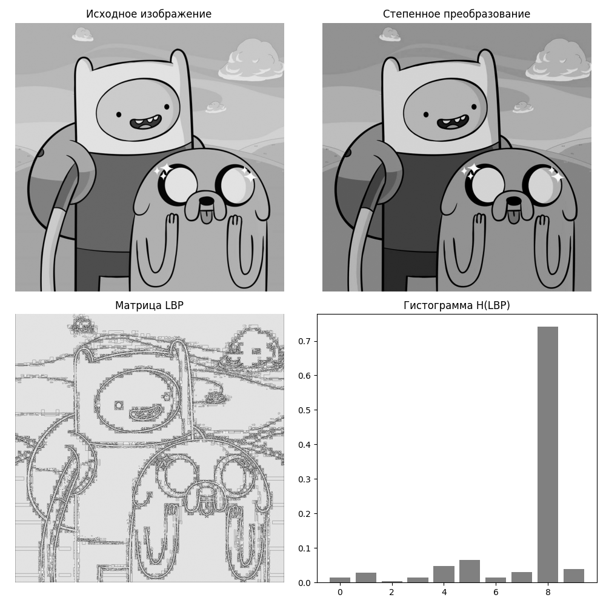
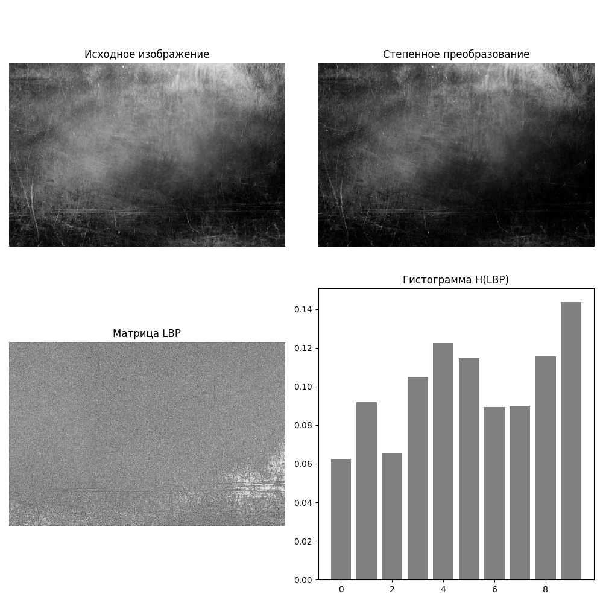

## Лабораторная работа №8. Текстурный анализ и контрастирование 

## Матрица - LBP
## Pасчёт признаков - H(LBP)
## Метод преобразования яркости - Степенное 

# Пример 1

# Исходное изображение
  

# Результат
 

# Текстурные признаки
До преобразования:    Coarseness=0.0002, Contrast=8.3215, Busyness=0.0001

После преобразования: Coarseness=0.0002, Contrast=7.1574, Busyness=0.0001

# Пример 2

# Исходное изображение
  

# Результат
 

# Текстурные признаки
До преобразования:    Coarseness=0.0001, Contrast=11.1095, Busyness=0.0000

После преобразования: Coarseness=0.0001, Contrast=9.6524, Busyness=0.0000

# Пример 3

# Исходное изображение
  

# Результат
 

# Текстурные признаки
До преобразования:    Coarseness=0.0000, Contrast=4.2755, Busyness=0.0000

После преобразования: Coarseness=0.0000, Contrast=5.0123, Busyness=0.0000