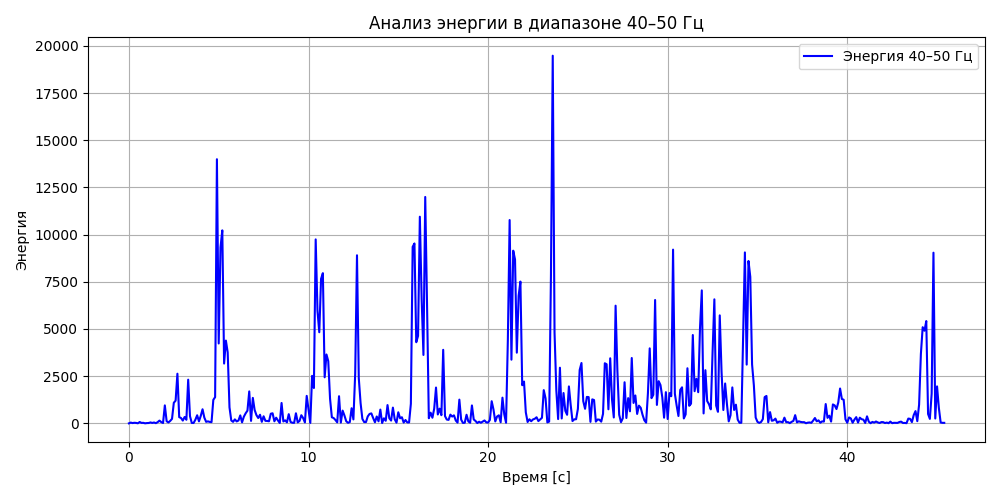

# Лабораторная работа №9  Анализ шума

## Спектрограммы

### До фильтрации

### После фильтрации

## Анализ энергии в диапазоне 40–50 Гц

## Анализ пиков энергии

- 28.468s @ 86.1Hz — energy=0.21
- 29.756s @ 86.1Hz — energy=0.21
- 44.791s @ 129.2Hz — energy=0.19
- 27.179s @ 86.1Hz — energy=0.19
- 23.882s @ 86.1Hz — energy=0.18
- 31.695s @ 86.1Hz — energy=0.17
- 24.555s @ 172.3Hz — energy=0.17
- 33.622s @ 86.1Hz — energy=0.17
- 25.867s @ 86.1Hz — energy=0.16
- 26.517s @ 172.3Hz — energy=0.16