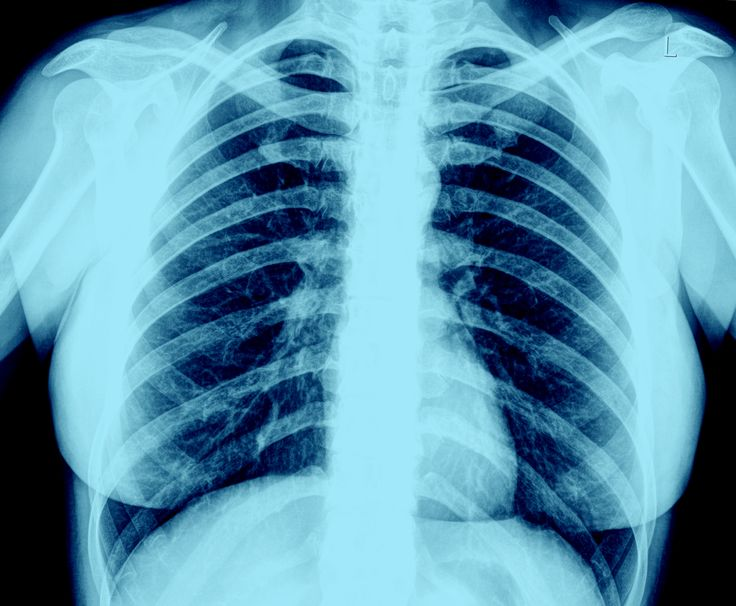
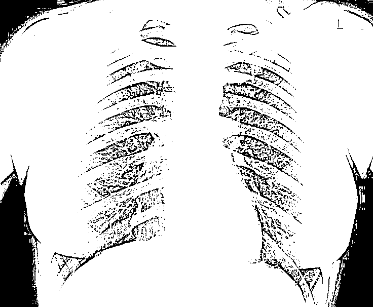
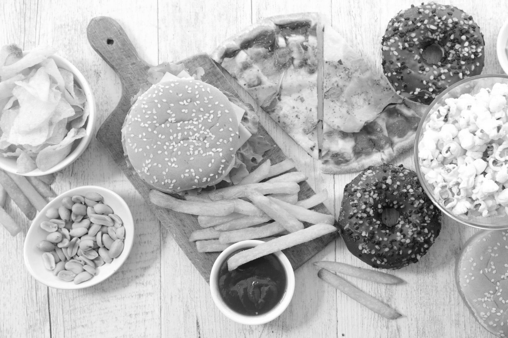
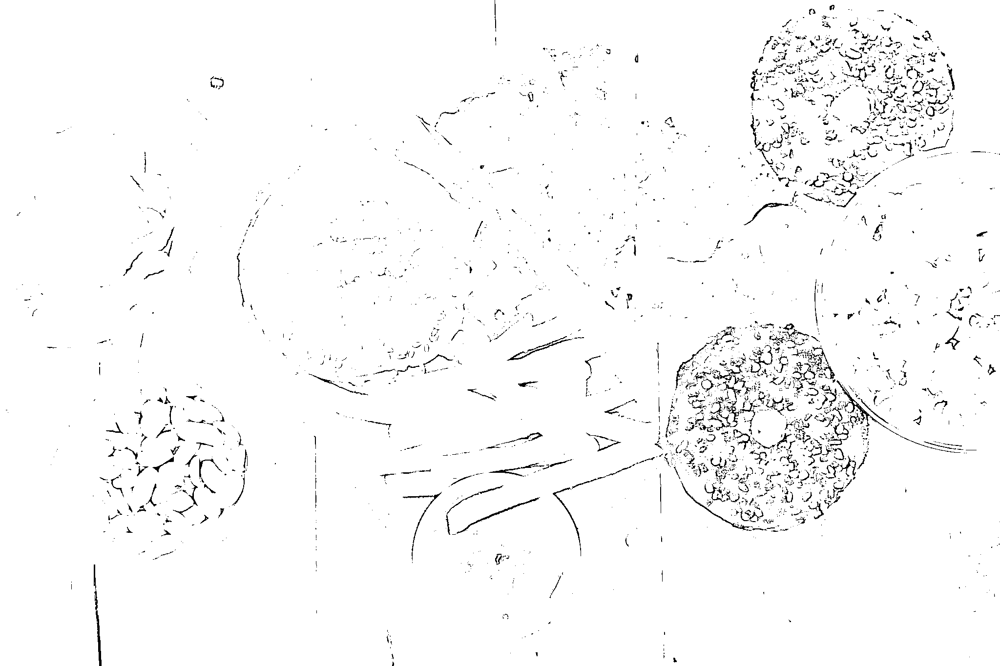
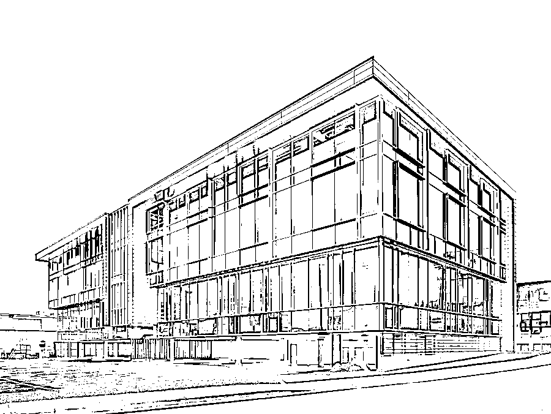
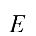

# Маргарян Давид Арменович Б22-554

# Лабораторная работа №1. Цветовые модели и передискретизация изображений 
# 1. Цветовые модели  
## Исходное изображение  
  

### 1.1. Выделить компоненты R, G, B  
**Компонент R**  
  

**Компонент G**  
  

**Компонент B**  
  

---

### 1.2. Привести изображение к цветовой модели HSI  
  

---

### 1.3. Инвертировать яркостную компоненту  
  

---

# 2. Передискретизация  
### 2.1. Растяжение (интерполяция) изображения в M раз  
  

---

### 2.2. Сжатие (децимация) изображения в N раз  
  

---

### 2.3. Передискретизация изображения в \(K = M / N\) раз путём растяжения и последующего сжатия  
  

---

### 2.4. Передискретизация изображения в \(K\) раз за один проход  
  


# Лабораторная работа №2. Обесцвечивание и бинаризация растровых изображений. Адаптивная бинаризация Вульфа. Окно 7 × 7
Исходное изображение

Полутоновое изображение


---
##### 2 Приведение полутонового изображения к монохромному методом пороговой обработки
#### Контурная карта
Оригинальное изображение


Полутоновое изображение


Монохромное изображение


---
#### Рентгеновский снимок
Оригинальное изображение


Полутоновое изображение


Монохромное изображение


---
##### Еда
Оригинальное изображение


Полутоновое изображение


Монохромное изображение


---
##### Фотография
Оригинальное изображение


Полутоновое изображение


Монохромное изображение


---
##### Здание
Оригинальное изображение


Полутоновое изображение


Монохромное изображение


---
##### Cтраница текста
Оригинальное изображение


Полутоновое изображение


Монохромное изображение


# Лабораторная работа №3. Фильтрация изображений и морфологические операции. Ранговый фильтр. Ранг 7/9. Маска — косой крест  
## Исходное изображение  
  

### 1. Отфильтрованное монохромное (полутоновое) изображение  
  

---

### 2. Разностное изображение (монохромный xor или модуль разности для полутона)
  

---

## Исходное изображение  
  

### 1. Отфильтрованное монохромное (полутоновое) изображение  
  

---

### 2. Разностное изображение (монохромный xor или модуль разности для полутона)
  


# Лабораторная работа №4 Выделение контуров на изображении. Оператор Робертса 2 × 2 


### Пример 1

#####  1. Исходное цветное изображение


##### 2. Полутоновое изображение


##### 3. Градиентные матрицы
###### 3.1 Градиентная матрица Gx 


###### 3.2 Градиентная матрица Gy


###### 3.3 Градиентная матрица G 


##### 4. Бинаризованная градиентные матрица


### Пример 2

#####  1. Исходное цветное изображение


##### 2. Полутоновое изображение


##### 3. Градиентные матрицы
###### 3.1 Градиентная матрица Gx 


###### 3.2 Градиентная матрица Gy


###### 3.3 Градиентная матрица G 


##### 4. Бинаризованная градиентные матрица


## Лабораторная работа №5. Выделение признаков символов
## Греческие заглавные буквы  
 

 

 

 

 

 

 

 

 

 

 

 

 

 

 

 


 

 

 

 

 

 


## Набор признаков
`features.csv`

| har | q1_abs | q2_abs | q3_abs | q4_abs | q1_rel | q2_rel | q3_rel | q4_rel | center_x | center_y | center_x_rel | center_y_rel | ix | iy | ix_rel | iy_rel |
|:---:|:------:|:------:|:------:|:------:|:------:|:------:|:------:|:------:|:--------:|:--------:|:------------:|:------------:|:--:|:--:|:------:|:------:|
| Α | 0 | 21 | 69 | 154 | 0.0 | 0.0149 | 0.0491 | 0.1095 | 38.11 | 52.23 | 0.5015 | 0.6831 | 23767.68 | 12184.01 | 0.000732 | 0.000375 |
| Β | 27 | 26 | 148 | 151 | 0.0197 | 0.019 | 0.1081 | 0.1103 | 36.72 | 49.4 | 0.4893 | 0.654 | 39160.32 | 21753.16 | 0.001271 | 0.000706 |
| Γ | 18 | 38 | 148 | 21 | 0.0125 | 0.0263 | 0.1025 | 0.0145 | 33.85 | 48.24 | 0.4323 | 0.6216 | 29761.04 | 20842.16 | 0.000847 | 0.000593 |
| Δ | 33 | 23 | 154 | 142 | 0.0223 | 0.0155 | 0.1041 | 0.0959 | 39.37 | 49.24 | 0.4857 | 0.6519 | 39518.47 | 42900.25 | 0.001098 | 0.001192 |
| Ε | 27 | 28 | 157 | 61 | 0.0197 | 0.0205 | 0.1147 | 0.0446 | 34.25 | 49.86 | 0.4493 | 0.6603 | 37103.99 | 15837.06 | 0.001173 | 0.000501 |
| Ζ | 30 | 29 | 158 | 31 | 0.0213 | 0.0206 | 0.1124 | 0.022 | 33.42 | 47.41 | 0.4266 | 0.6271 | 29781.87 | 15292.39 | 0.000893 | 0.000459 |
| Η | 21 | 37 | 148 | 103 | 0.0142 | 0.025 | 0.0999 | 0.0695 | 37.85 | 50.19 | 0.4786 | 0.6473 | 35694.35 | 34807.15 | 0.00099 | 0.000965 |
| Θ | 37 | 38 | 173 | 159 | 0.0238 | 0.0245 | 0.1113 | 0.1023 | 39.86 | 48.87 | 0.4626 | 0.6469 | 48054.84 | 45021.02 | 0.001182 | 0.001108 |
| Ι | 5 | 30 | 120 | 29 | 0.0042 | 0.0253 | 0.1014 | 0.0245 | 29.72 | 49.18 | 0.4558 | 0.6511 | 23649.72 | 2505.3 | 0.001026 | 0.000109 |
| Κ | 0 | 42 | 88 | 83 | 0.0 | 0.0316 | 0.0662 | 0.0624 | 33.58 | 50.46 | 0.4655 | 0.6595 | 27830.91 | 10981.81 | 0.000956 | 0.000377 |
| Λ | 36 | 32 | 209 | 86 | 0.0243 | 0.0216 | 0.1412 | 0.0581 | 35.83 | 49.92 | 0.4409 | 0.6611 | 46627.84 | 22855.41 | 0.001295 | 0.000635 |
| Μ | 23 | 14 | 153 | 31 | 0.0178 | 0.0108 | 0.1181 | 0.0239 | 31.26 | 51.2 | 0.4323 | 0.6784 | 30207.24 | 6838.3 | 0.001065 | 0.000241 |
| Ν | 31 | 33 | 209 | 188 | 0.0186 | 0.0198 | 0.1255 | 0.1129 | 43.68 | 49.33 | 0.4742 | 0.6531 | 49781.88 | 65732.13 | 0.001069 | 0.001411 |
| Ξ | 37 | 27 | 139 | 98 | 0.0237 | 0.0173 | 0.0892 | 0.0629 | 38.43 | 48.04 | 0.4621 | 0.6272 | 33158.44 | 23835.85 | 0.000854 | 0.000614 |
| Ο | 18 | 38 | 152 | 140 | 0.0121 | 0.0256 | 0.1026 | 0.0945 | 39.67 | 49.19 | 0.5022 | 0.634 | 35822.86 | 48010.66 | 0.000993 | 0.001331 |
| Π | 28 | 27 | 155 | 65 | 0.0205 | 0.0197 | 0.1132 | 0.0475 | 35.16 | 46.68 | 0.4616 | 0.6173 | 29923.84 | 20656.96 | 0.000946 | 0.000653 |
| Ρ | 39 | 60 | 194 | 148 | 0.0233 | 0.0358 | 0.1157 | 0.0883 | 38.73 | 54.88 | 0.4901 | 0.6265 | 82282.14 | 54171.96 | 0.001787 | 0.001176 |
| Σ | 31 | 27 | 152 | 148 | 0.0226 | 0.0197 | 0.111 | 0.1081 | 36.06 | 49.27 | 0.4802 | 0.6523 | 41532.26 | 20560.88 | 0.001348 | 0.000668 |
| Τ | 22 | 31 | 92 | 110 | 0.017 | 0.024 | 0.0712 | 0.0851 | 34.28 | 49.16 | 0.4894 | 0.6337 | 31737.08 | 11279.23 | 0.001124 | 0.0004 |
| Υ | 22 | 46 | 122 | 39 | 0.0161 | 0.0336 | 0.0891 | 0.0285 | 35.85 | 46.59 | 0.4774 | 0.6161 | 31929.23 | 9447.65 | 0.001037 | 0.000307 |
| Φ | 42 | 25 | 133 | 56 | 0.027 | 0.016 | 0.0854 | 0.0359 | 37.4 | 47.35 | 0.4439 | 0.618 | 31770.36 | 28451.36 | 0.000798 | 0.000715 |
| Χ | 37 | 29 | 137 | 26 | 0.025 | 0.0196 | 0.0924 | 0.0175 | 35.55 | 45.83 | 0.4488 | 0.5977 | 23913.01 | 12328.57 | 0.00068 | 0.000351 |
| Ψ | 45 | 65 | 191 | 134 | 0.0263 | 0.038 | 0.1117 | 0.0784 | 41.56 | 46.37 | 0.4557 | 0.6049 | 42877.15 | 44835.37 | 0.000916 | 0.000958 |
| Ω | 35 | 28 | 167 | 60 | 0.0231 | 0.0185 | 0.1101 | 0.0396 | 37.55 | 48.93 | 0.4458 | 0.6478 | 39937.76 | 16855.72 | 0.001031 | 0.000435 |


## Лабораторная работа №6. Сегментация текста
##  Греческие заглавные буквы

  
*Рис. 3 — Сегментированное изображение с обводкой символов*

  
  
  
  
  
  
  
  
  
  

  
  
  
  
  
  
  
  
  
  


## Лабораторная работа №7. Классификация на основе признаков, анализ профилей
# Задание 1
  

# Задание 2-3


`recognized_hypotheses.txt`

Ниже приведены первые 24 строки гипотез, полученных в ходе распознавания.  
Каждая строка соответствует символу из распознаваемой фразы и содержит  
список гипотез с оценкой достоверности (по убыванию):

```python
1: [('A', 0.9797), ('F', 0.8585), ('C', 0.8392), ('I', 0.7277), ('P', 0.7097), ('T', 0.7093), ('H', 0.6907), ('J', 0.6735), ('R', 0.6586)]
2: [('Β', 0.9576), ('N', 0.8772), ('W', 0.827), ('B', 0.7062), ('L', 0.7053), ('G', 0.7047), ('U', 0.6719), ('Z', 0.6658), ('A', 0.6626)]
3: [('Γ', 0.9508), ('H', 0.8543), ('T', 0.8495), ('R', 0.7288), ('S', 0.6732), ('W', 0.6646), ('K', 0.6338), ('B', 0.6303), ('I', 0.6102)]
4: [('Δ', 0.9541), ('J', 0.8555), ('T', 0.8208), ('E', 0.717), ('X', 0.7167), ('G', 0.694), ('Q', 0.6919), ('B', 0.6829), ('M', 0.6145)]
5: [('Ε', 0.934), ('A', 0.8493), ('Y', 0.8087), ('H', 0.786), ('U', 0.7656), ('B', 0.7333), ('J', 0.6438), ('W', 0.629), ('Q', 0.605)]
6: [('Ζ', 0.9557), ('B', 0.8445), ('P', 0.7779), ('X', 0.7557), ('W', 0.7527), ('I', 0.751), ('O', 0.7485), ('Z', 0.6531), ('R', 0.6307)]
7: [('N', 0.8806), ('P', 0.854), ('G', 0.8533), ('H', 0.7754), ('D', 0.7062), ('M', 0.6822), ('C', 0.6713), ('Η', 0.6697), ('S', 0.6248), ('K', 0.6132)]
8: [('Θ', 0.9833), ('C', 0.8291), ('H', 0.8045), ('B', 0.7803), ('D', 0.7195), ('Q', 0.6986), ('E', 0.6894), ('T', 0.6449), ('N', 0.6373)]
9: [('Ι', 0.974), ('C', 0.8222), ('L', 0.8212), ('G', 0.7612), ('Z', 0.7378), ('V', 0.7006), ('H', 0.6826), ('S', 0.6002), ('K', 0.6001)]
10: [('Κ', 0.9779), ('Z', 0.8247), ('X', 0.8238), ('V', 0.8045), ('E', 0.7723), ('S', 0.7076), ('D', 0.663), ('M', 0.644), ('W', 0.627)]
11: [('Λ', 0.9612), ('G', 0.8625), ('A', 0.8555), ('O', 0.798), ('L', 0.76), ('E', 0.717), ('I', 0.6643), ('P', 0.6241), ('K', 0.608)]
12: [('Μ', 0.9774), ('A', 0.8733), ('K', 0.8198), ('L', 0.7092), ('H', 0.704), ('V', 0.6489), ('B', 0.6365), ('X', 0.6125), ('D', 0.6077)]
13: [('Ν', 0.9872), ('Z', 0.8798), ('A', 0.8492), ('M', 0.7442), ('C', 0.7258), ('V', 0.6532), ('W', 0.653), ('F', 0.6398), ('I', 0.6374)]
14: [('Ξ', 0.9443), ('L', 0.8133), ('R', 0.7856), ('Y', 0.7815), ('U', 0.7153), ('W', 0.7098), ('T', 0.6656), ('C', 0.6407), ('B', 0.6382)]
15: [('Ο', 0.9542), ('S', 0.8578), ('D', 0.8213), ('R', 0.777), ('K', 0.7525), ('A', 0.7302), ('G', 0.7074), ('Z', 0.622), ('B', 0.6152)]
16: [('Π', 0.9606), ('T', 0.8442), ('N', 0.8371), ('C', 0.7252), ('S', 0.682), ('G', 0.6679), ('M', 0.6654), ('L', 0.642), ('E', 0.6335)]
17: [('Ρ', 0.978), ('F', 0.8755), ('A', 0.7272), ('D', 0.7011), ('N', 0.661), ('X', 0.6418), ('R', 0.6361), ('O', 0.6259), ('Q', 0.6232)]
18: [('Σ', 0.9788), ('Q', 0.8328), ('J', 0.8275), ('L', 0.7626), ('X', 0.7551), ('C', 0.7449), ('D', 0.7263), ('R', 0.6996), ('T', 0.6878)]
19: [('Τ', 0.9795), ('Q', 0.8735), ('I', 0.8232), ('V', 0.8045), ('A', 0.7621), ('C', 0.7554), ('L', 0.6963), ('X', 0.6921), ('E', 0.6299)]
20: [('Υ', 0.9544), ('A', 0.8391), ('Q', 0.8107), ('Y', 0.8043), ('C', 0.8032), ('T', 0.7989), ('E', 0.6527), ('N', 0.6474), ('D', 0.6254)]
21: [('O', 0.893), ('W', 0.8774), ('K', 0.8731), ('Z', 0.8723), ('F', 0.8611), ('Q', 0.8518), ('X', 0.7788), ('N', 0.7416), ('M', 0.6753), ('Φ', 0.6333)]
22: [('Χ', 0.9455), ('I', 0.8548), ('Q', 0.8501), ('H', 0.8412), ('X', 0.8), ('Y', 0.7904), ('B', 0.7844), ('D', 0.7763), ('C', 0.6503)]
23: [('D', 0.9149), ('E', 0.8401), ('S', 0.738), ('N', 0.7233), ('M', 0.696), ('V', 0.6931), ('Q', 0.6722), ('W', 0.656), ('Z', 0.6444), ('Ψ', 0.6237)]
24: [('R', 0.9078), ('K', 0.8368), ('E', 0.8352), ('A', 0.8297), ('N', 0.8172), ('L', 0.7944), ('B', 0.6833), ('P', 0.639), ('Ω', 0.6239), ('C', 0.6111)]


```
# Задание 4

Распознанная строка:
AΒΓΔΕΖNΘΙΚΛΜΝΞΟΠΡΣΤΥOΧDR


Ожидаемая строка:
AΒΓΔΕΖΗΘΙΚΛΜΝΞΟΠΡΣΤΥΦΧΨΩ


# Задание 5

Количество ошибок: 3
Доля верно распознанных символов: 87.50%


# Задание 6

Распознанная строка (моделирование изменённого шрифта):
PΒΓΔΕΖNΘΙΚΛΜΝΞΟΠΡΣΤΥOΧDΩ

Ожидаемая строка:
AΒΓΔΕΖΗΘΙΚΛΜΝΞΟΠΡΣΤΥΦΧΨΩ

Количество ошибок: 4
Доля верно распознанных символов: 83.33%


## Лабораторная работа №8. Текстурный анализ и контрастирование 

## Матрица - LBP
## Pасчёт признаков - H(LBP)
## Метод преобразования яркости - Степенное 

# Пример 1

# Исходное изображение
  

# Результат
 

# Текстурные признаки
До преобразования:    Coarseness=0.0002, Contrast=8.3215, Busyness=0.0001

После преобразования: Coarseness=0.0002, Contrast=7.1574, Busyness=0.0001


# Пример 2

# Исходное изображение
  

# Результат
 

# Текстурные признаки
До преобразования:    Coarseness=0.0001, Contrast=11.1095, Busyness=0.0000

После преобразования: Coarseness=0.0001, Contrast=9.6524, Busyness=0.0000


# Пример 3

# Исходное изображение
  

# Результат
 

# Текстурные признаки
До преобразования:    Coarseness=0.0000, Contrast=4.2755, Busyness=0.0000

После преобразования: Coarseness=0.0000, Contrast=5.0123, Busyness=0.0000


# Лабораторная работа №9  Анализ шума

## Спектрограммы

### До фильтрации


### После фильтрации


## Анализ энергии в диапазоне 40–50 Гц


## Анализ пиков энергии

- 28.468s @ 86.1Hz — energy=0.21
- 29.756s @ 86.1Hz — energy=0.21
- 44.791s @ 129.2Hz — energy=0.19
- 27.179s @ 86.1Hz — energy=0.19
- 23.882s @ 86.1Hz — energy=0.18
- 31.695s @ 86.1Hz — energy=0.17
- 24.555s @ 172.3Hz — energy=0.17
- 33.622s @ 86.1Hz — energy=0.17
- 25.867s @ 86.1Hz — energy=0.16
- 26.517s @ 172.3Hz — energy=0.16


# Лабораторная работа №10. Обработка голоса
Построены спектрограммы записи названных звуков и приведен их анализ: 
- Определение примерных минимальной и максимальной частот голоса
- Поиск тембрально окрашенного тона
- Поиск самых сильных формант

## Спектрограмма записи звука "А" по нарастающей


### Анализ
**Основной тон:** примерно 86 Гц

**Форманты:** форманта **FI** находится на частоте примерно 86 Гц, **FII** на частоте примерно 602 Гц,
**FIII** на частоте 861 Гц, **FIV** 1119 Гц

**Максимальная частоста:** 1894 Гц

## Спектрограмма записи звука "И" по нарастающей


### Анализ
**Основной тон:** примерно 86 Гц

**Форманты:** основная форманта **FI** находится на частоте примерно 86 Гц, далее, после провала прослеживается **FII** на частоте примерно 344 Гц, еще выше **FIII** на частоте 602 Гц, **FIV** 1119 Гц

**Максимальная частоста:** 3186 Гц

## Спектрограмма записи лая


**Максимальная частоста:** 1808 Гц